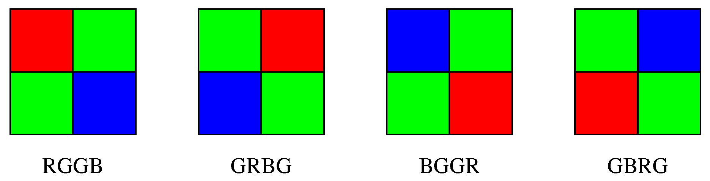
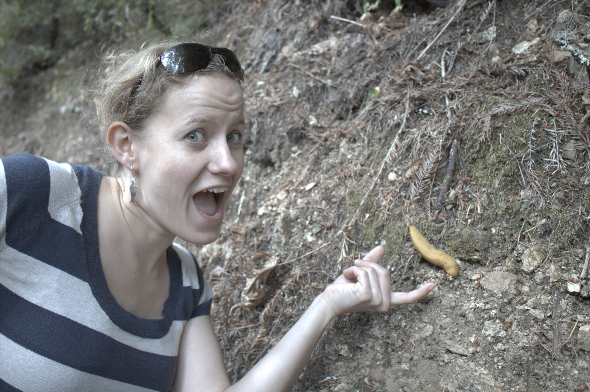
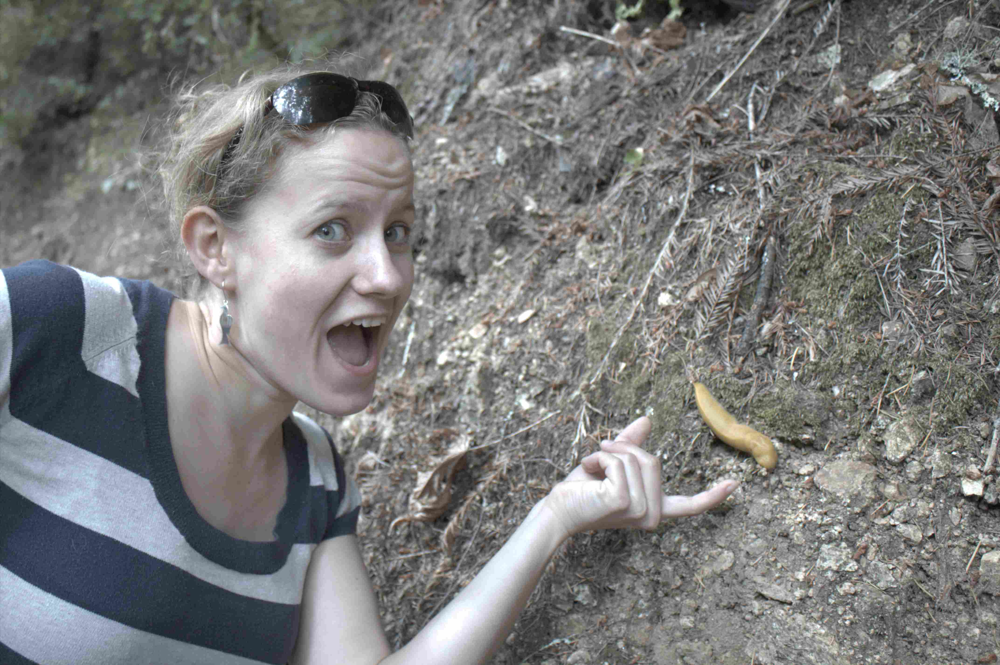
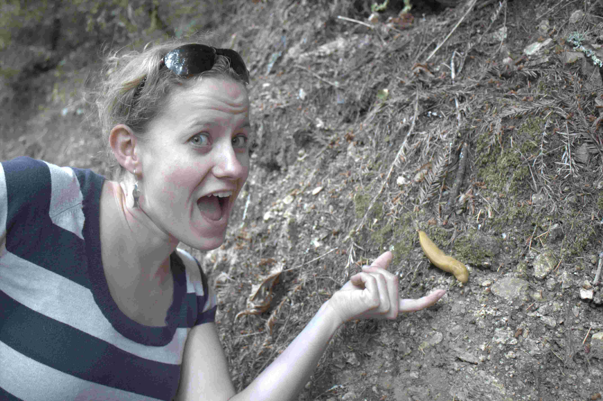
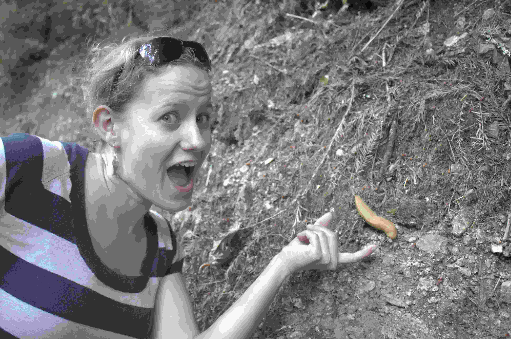

This project aims to recover original image from '.tiff' via basic image processing pipeline.   

## Initials

The following code read the input image using <code>imread</code> and output the size of the image using <code>size</code>

```matlab
tiff = imread('.\data\banana_slug.tiff');
tiff_size = size(tiff);
```

## Linearization 

Linearization of the image is done by normalizing pixel values of the image while removing overexposed and supposedly black pixels.

Originally, data type of pixels in the images are <code>uint16</code>, which needs to be coverted to <code>double</code> for linearization to take place. Since any pixel with values under 2047 and over 15000 are 0 and 1, respectively, the acceptable pixels have values in between 2047 and 12953. Hence, pixels are normalized with possible maximum value, which is 12953. After normalization, pixels with values greater than 1 are forcefully set as 1 while pixels with negative values are set as 0.

```matlab
tiff_double = double(tiff);
pixel_max = 15000;
pixel_min = 2047;

linearized_tiff = tiff_double / (pixel_max - pixel_min) - pixel_min / (pixel_max - pixel_min);
linearized_tiff(linearized_tiff > 1) = 1;
linearized_tiff(linearized_tiff < 0) = 0;
```

The following imags show result of linearization. The right image is brightened by 5 times the left one to vividly show the effect of linearization.

<table>
    <tr>
        <th>Linearization</th>
        <th>Linearization * 5</th>
    </tr>
    <tr>
        <td></td>
        <td></td>
    </tr>
</table>

## Identifying the correct bayer pattern

In order to identify the correct bayer pattern, one must discover the correct position of the green pixels. In any patch, there are two green cells. As a result, the result of difference between two green cells should be minimum. Therefore, each position of cells are grouped as patches, and patches are subtracted by each other in order to find two patches resulting minimum difference.

<table>
    <tr>
        <th>bayer pattern</th>
    </tr>
    <tr>
        <td></td>
    </tr>
</table>

```matlab
patch1 = linearized_tiff(1:2:end, 1:2:end);
patch2 = linearized_tiff(1:2:end, 2:2:end);
patch3 = linearized_tiff(2:2:end, 1:2:end);
patch4 = linearized_tiff(2:2:end, 2:2:end);

difference_1_2 = abs(patch1 - patch2);
difference_1_3 = abs(patch1 - patch3);
difference_1_4 = abs(patch1 - patch4);
difference_2_3 = abs(patch2 - patch3);
difference_2_4 = abs(patch2 - patch4);
difference_3_4 = abs(patch3 - patch4);

sum_1_2 = sum(difference_1_2(:));
sum_1_3 = sum(difference_1_3(:));
sum_1_4 = sum(difference_1_4(:));
sum_2_3 = sum(difference_2_3(:));
sum_2_4 = sum(difference_2_4(:));
sum_3_4 = sum(difference_3_4(:));
```

The result shows that the difference between patch2 and patch3 is the smallest. As a result, the remaining possible bayer patterns are RGGB and BGGR. In choose between these two pattern, the results after applying each pattern are compared. 

```matlab
% bggr
red = patch4;
green = (patch2 + patch3) / 2;
blue = patch1;
bggr = cat(3, red, green, blue);

% rggb
red = patch1;
green = (patch2 + patch3) / 2;
blue = patch4;
rggb = cat(3, red, green, blue);
```

When comparing these two images, the RGGB seemingly conveys more accurate portrait of hues than that of BGGR. 

<table>
    <tr>
        <th>bggr</th>
        <th>rggb</th>
    </tr>
    <tr>
        <td></td>
        <td></td>
    </tr>
</table>

## White balancing

After applying bayer pattern on the image, white balancing must be done, because green channel is visually much stronger than the other channels. 

```matlab
% gray
mean_red = mean(mean(rggb(:,:,1)));
mean_green = mean(mean(rggb(:,:,2)));
mean_blue = mean(mean(rggb(:,:,3)));
gray_red = rggb(:,:,1) * mean_green / mean_red;
gray_green = rggb(:,:,2);
gray_blue = rggb(:,:,3) * mean_green / mean_blue;
gray_balanced_img = cat(3, gray_red, gray_green, gray_blue);
```


```matlab
% white
max_red = max(max(rggb(:,:,1)));
max_green = max(max(rggb(:,:,2)));
max_blue = max(max(rggb(:,:,3)));
white_red = rggb(:,:,1) * max_green / max_red;
white_green = rggb(:,:,2);
white_blue = rggb(:,:,3) * max_green / max_blue;
white_balanced_img = cat(3, white_red, white_green, white_blue);
```

The following images shows the result of white balancing the image in gray and white world automatic white balancing. When white balancing in white world, the color contrast is more clear than that of gray world. Since the colors are more balanced in gray world, the later procedures will be done using the gray world image. 

<table>
    <tr>
        <th>gray world</th>
        <th>white world</th>
    </tr>
    <tr>
        <td></td>
        <td></td>
    </tr>
</table>

## Demosaicing

Using <code>interp2</code>, bilinear interpolation is performed for demosaicing the white balanced image. 

```matlab
demosaic_red = interp2(gray_balanced_img(:,:,1));
demosaic_green = interp2(gray_balanced_img(:,:,2));
demosaic_blue = interp2(gray_balanced_img(:,:,3));
demosaic_img = cat(3, demosaic_red, demosaic_green, demosaic_blue);
```

<table>
    <tr>
        <th>demosaiced image</th>
    </tr>
    <tr>
        <td></td>
    </tr>
</table>

## Brightness Adjustment and Gamma Correction

Before performing gamma correction, the overall brightness of image is enhanced. The intensity of each pixel in the image are enhanced by 4 times. With some extra trials, it is found that some enhancement over 4 can cause overexposure while some under 4 can cause few dark pixels.

```matlab
prebrightened_img = demosaic_img * 4;

grayscale_img = rgb2gray(prebrightened_img);
if grayscale_img < 0.0031308
    gamma_corrected_img = 12.92 * prebrightened_img;
else 
    gamma_corrected_img = (1 + 0.055) * prebrightened_img.^(1/2.4) - 0.055;
end
```

<table>
    <tr>
        <th>gamma corrected image</th>
    </tr>
    <tr>
        <td></td>
    </tr>
</table>

## Compression

The follwing code saves the processed image in png or jpeg format. When saving in jpeg format, one can specify the quality of image to be saved by simply adding the parameter <code>'quality'</code> followed by the number.

```matlab
imwrite(gamma_corrected_img, 'final_result.png');
imwrite(gamma_corrected_img, 'final_result_95.jpeg', 'quality', 95);
imwrite(gamma_corrected_img, 'final_result_75.jpeg', 'quality', 75);
imwrite(gamma_corrected_img, 'final_result_65.jpeg', 'quality', 65);
imwrite(gamma_corrected_img, 'final_result_55.jpeg', 'quality', 55);
imwrite(gamma_corrected_img, 'final_result_45.jpeg', 'quality', 45);
imwrite(gamma_corrected_img, 'final_result_35.jpeg', 'quality', 35);
imwrite(gamma_corrected_img, 'final_result_25.jpeg', 'quality', 25);
imwrite(gamma_corrected_img, 'final_result_15.jpeg', 'quality', 15);
imwrite(gamma_corrected_img, 'final_result_10.jpeg', 'quality', 10);
imwrite(gamma_corrected_img, 'final_result_5.jpeg', 'quality', 5);
```

The following images shows that it hard to differentiate between the uncompressed and compressed image until the quality of image drops under 10. Images with quality under 10 fails to keep accurate information of color. 

<table>
    <tr>
        <th>png image</th>
        <th>quality 95% jpeg image</th>
        <th>quality 85% jpeg image</th>
        <th>quality 75% jpeg image</th>
    </tr>
    <tr>
        <td></td>
        <td></td>
        <td></td>
        <td></td>
    </tr>
    <tr>
        <th>quality 65% jpeg image</th>
        <th>quality 55% jpeg image</th>
        <th>quality 45% jpeg image</th>
        <th>quality 35% jpeg image</th>
    </tr>
    <tr>
        <td></td>
        <td></td>
        <td></td>
        <td></td>
    </tr>
    <tr>
        <th>quality 25% jpeg image</th>
        <th>quality 15% jpeg image</th>
        <th>quality 10% jpeg image</th>
        <th>quality 5% jpeg image</th>
    </tr>
    <tr>
        <td></td>
        <td></td>
        <td></td>
        <td></td>
    </tr>
</table>

The file size of the uncompressed image (.png) is 17039693.   
The file size of the compressed image (.jpeg) is 8232450.   
    
The compression ratio is **8232450 / 17039693 = 0.483133704345495**

